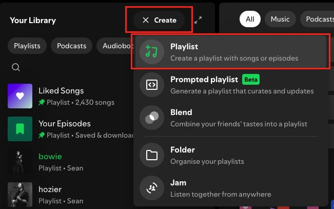
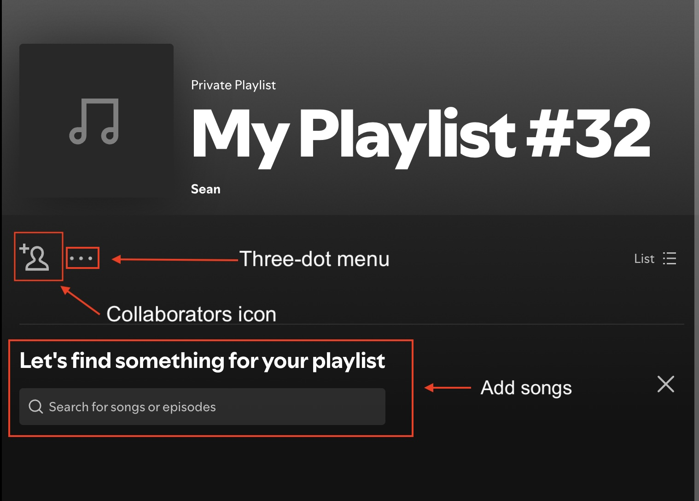

# How to create a new Spotify playlist (Desktop)
## Purpose
This is a how-to guide for beginner Spotify users who want to create a new playlist, add songs to the playlist, and share the playlist. 
## Style
Heywood house style guide (i.e., UI in bold, user-centred text in italics).
## Steps 
1. Click the **Create** button in the top left corner of your homepage.
2. Select **Playlist** from the drop-down menu.

3. To edit the playlist name, select the three-dot menu > **Edit details**.
4. Click **Save**.
5. Use the **Let’s find something for your playlist** search bar > locate a song > click **Add**. 
6. Click the **Invite collaborators** icon or three-dot menu to copy the playlist link to your clipboard.

7. Paste (Command+V or Ctrl+V) the link in your messaging app to share with collaborators. 
## Need more help?
- Visit [Spotify Support](https://support.spotify.com/uk/)
- Ask the [Spotify Community](https://community.spotify.com/)
